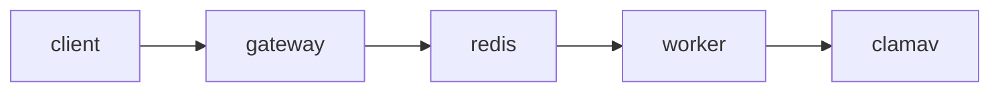

# Architecture

This project follows a microservices pattern with a Java API gateway and a Python worker that communicates via Redis. The worker uses ClamAV to scan files and stores results back in Redis for retrieval by the gateway.

The worker exposes Prometheus counters on port `8000` while the API exposes standard Spring metrics at `/actuator/prometheus`.
